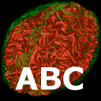

# ABC

ABC (Atlas Based Classification) is a comprehensive processing pipeline developed and used at University of North Carolina and University of Utah for brain MRIs.

The processing pipeline includes image registration, filtering, segmentation and inhomogeneity correction. The tool is cross-platform and can be run within 3D Slicer or as a stand-alone program.

The image segmentation algorithm is based on the EMS software developed by Koen van Leemput.

